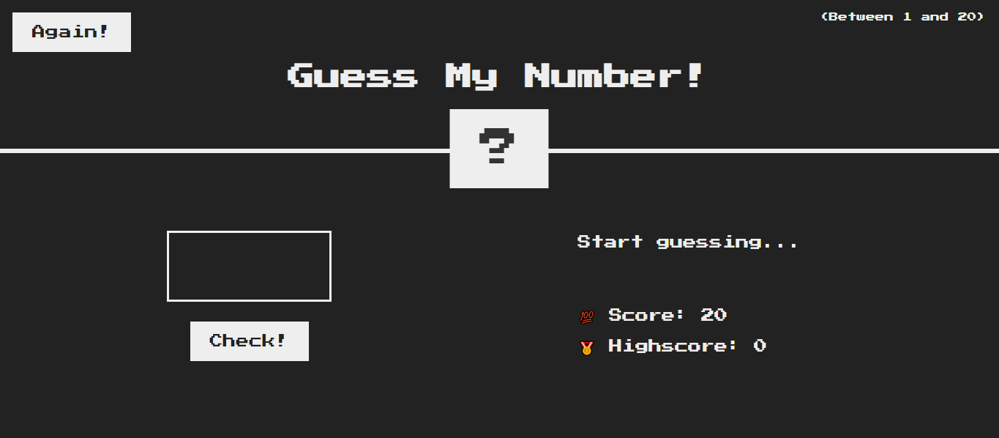

<!-- Feel Free to Add, Update, Delete Any Section you find needs so -->

# Guess My Number

> .This project is A game to guess the number between 1 To 20 and if you are close displays for you messages to be able to Guess the Right number. 🤔💭

## Live Version

[see live version here](https://reem-lab.github.io/Guess-my-number/)

## Built With

- Languages: _**HTML, CSS, JavaScript**_
- Frameworks: _**N/A**_
- Technologies used: _**GIT, GITHUB, LINTERS**_

## Authors

<!-- Only Change Username for Different Accounts -->

👤 **Reem**

 Platform | Badge |
 --- | --- |
 **GitHub**  | [@Reem-lab](https://github.com/Reem-lab)
 **Twitter** | [Rem79940127](https://twitter.com/Rem79940127)
 **LinkdIn** | [reem-janina](https://www.linkedin.com/in/reem-janina-ab74ab21a/)

## 🤝 Contributing

Contributions, issues, and feature requests are welcome!

Feel free to check the [issues page](https://github.com/MrRamoun/WEBDEV/issues).

## Show your support

Give a ⭐️ if you like this project!

## Acknowledgments

- The Original design idea by [JonasSchmedtman](https://github.com/jonasschmedtmann) .
- Hat tip to anyone whose code was used
- Inspiration
- etc

